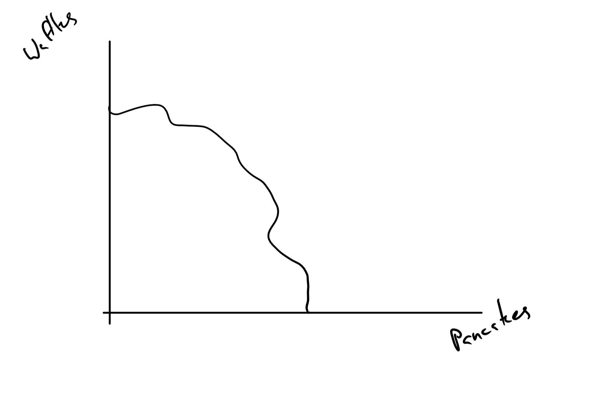
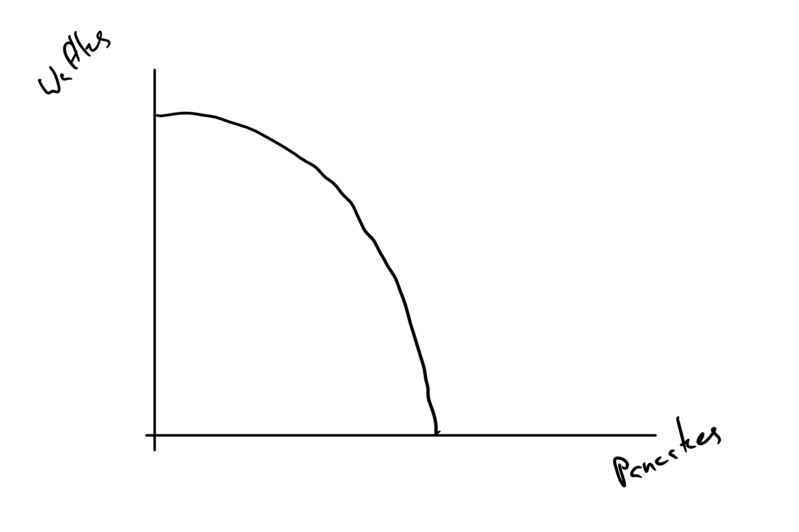
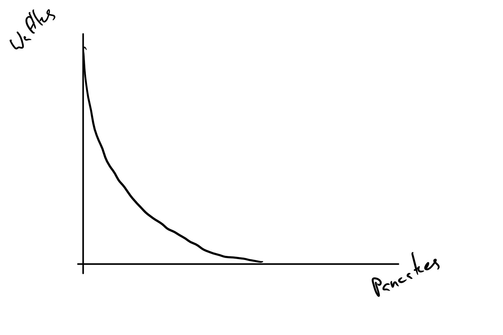
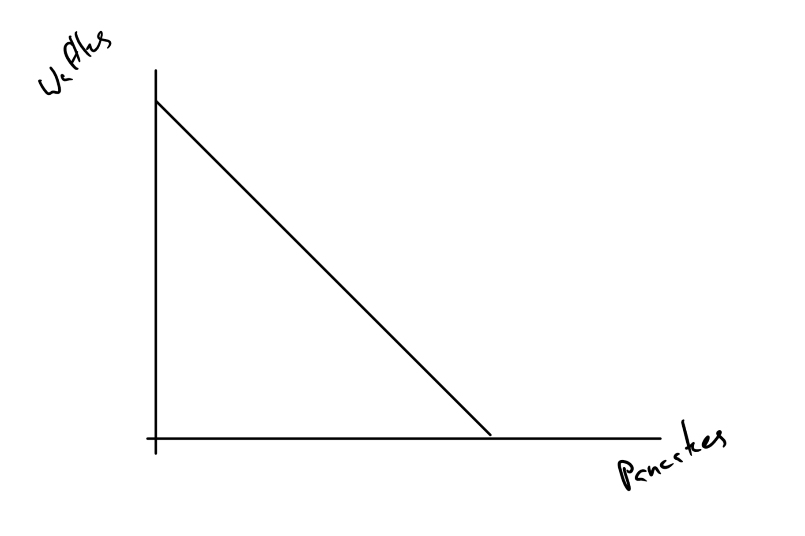
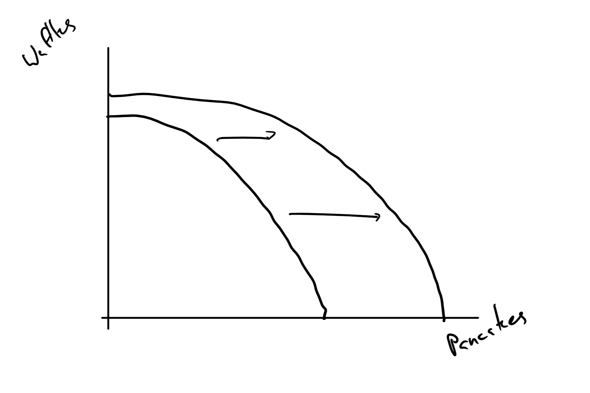

```{r setup, include=FALSE}
knitr::opts_chunk$set(echo = FALSE)
```


## Overview

+ Note on models and why they are important and false.
+ A few simple models: Production Possibilities Frontiers, Comparative Advantage and Circular-Flow
+ Positive vs Normative
+ Lets all get together and disagree.

## Details on Gains from Trade

Goal: Show that by specializing and engaging in trade that we can make everyone better off -- or at least not worse off.

Concepts:

+ "Opportunity Cost"
+ Comparative Advantage
+ Absolute Advantage
+ Resources
+ Technology

Tools:

+ Production Possibilities Set (Frontier)

## What is Model?

A (Good) model is a simplification of reality that:

+ Focuses on one part of reality
+ De-emphasizes others
+ Is falsifiable, i.e., you can imagine data that contradict it.

## The Only Perfect Model

Reality is the only model that perfectly predicts everything, but ...

+ That is a trivial statement
+ It is too complex to understand at once.


## Model Airplanes

Paper Airplanes vs Plastic Model Airplanes

+ One is good for lift, drag, thrust, gravity.
+ The other is good for spacial relationships.
+ They are bad where the other is good.

## PPFs or PPSs: Our First Model

Production Possibilities Sets (PPS) or Production Possibilities Frontiers (PPF)

PPS: The set of all combinations of "goods" that can be produced with the available *resources* and existing *technology*.

+ There are two words of art, "resources" and "technology"
+ Econ use and general public use of some words differs a lot.

## Resources

Resources: (AKA Inputs) What is used to create outputs.

Examples:

+ Spam
+ Time 
+ Attention
+ Eggs

## Technology

Technology: The method used to create outputs

Examples:

+ Three ways to make hollandaise: classic, pre-melted butter, blender
+ Three ways to split wood: Upright, sideways, in a tire.

## What We use the model for

Sort out:

+ How much we can produce of all "goods".
+ What it "costs" to change our production mix.
+ Does it make sense to get "goods" from elsewhere.

Remember that economists use words differently. The ones in quotations are special.

## Graphical Depiction of PPF

We have a graphical limitations -- 2 dimensional board

+ Commonly show two goods and assume all other goods held  equal or unchanged
    + Fancy pants say Ceteris paribus
+ One good and the other axis is all other goods.

## Example



## Interpreting the set

+ Points are combinations:
    + Inside the frontier means you can make that combination and you did not use up any of your resources. (Feasible but not "efficient")
    + On the frontier means you can make that combination but you have run out of at *least one* resource. (Feasible and "efficient")
    + Outside the set means you can't make the combination with existing  technology. (Not Feasible)

"Efficient" has many meanings to economists.  In this case it means you can't make more of one good without making less of other goods.

## Lets talk "Opportunity Cost"

We use the same word symbols for many thing:

+ The second best forgone option. (Discrete choice)
+ Including all costs and not just financial ones (Our general definition)
+ Counting only the what changes (When we are ignoring the effects of our breakfast choice on peace in the world.)
+ What you give up to get one more (Quantity choice)

## A Few Shapes

These are what the PPFs look like when you when opportunity costs are different.

+ Increasing Opportunity Cost:  The more you try to make of one good, the harder it is to make more.
+ Decreasing Opportunity Cost:  The more you try to make of one good, the easier it is to make more.
+ Constant Opportunity Cost.  The ease of making more of one good never changes.

This is Principle 3: “How much” is a decision at the margin. 

## Increasing Opportunity Cost





## Decreasing Opportunity Cost



## Constant Opportunity Cost




## How the shapes arise?

+ Increasing:
    + Most common BTW
    + Nature of process (gathering)
    + Bottleneck resources
    + Input quality changes
+ Decreasing:
    + Nature of process (Starting an avalanche)
    + Gains from Specialization
    + Sunk cost
+ Constant:
    + Like prices in a store.

## We can shift the curves too.

+ This is called economic growth
+ It can shrink too
+ why:
    + Changes in the quantities of the "factors of production"
    + "Factors of Production" A specific way of categorizing inputs/resources.
    + Technology changes

## Growth





## Factors of Production

This is the usual categorization of factors of production

+ Land: Natural resources, minerals, oil, natural gas, and actual land. Non-manufactured
+ Labor: People doing things with brains, hands and feet.
+ Physical Capital: Manufactured things use to produce other things.  Often  these are the embodiment of technology changes.
+ Human Capital: Skills of labor.  Another way that technological change is embodied.


## Get Started On Basis for Trade

+ Learn how to calculate opportunity cost for constant opportunity cost PPFs.

+ Relate the PPF shape to "Comparative Advantage" and  "Absolute Advantage".

+ Show that specialization follows comparative advantage

+ Show that extent of specialization follows absolute advantage.

## Calculating Opportunity Cost with PPFs

+ We will stick with constant cost for now
+ Find how much of one good we must give up to get one more of another good.
    + Note the two good assumption.
+ Do this three ways:
    + Arithmetic logic
    + Algebraic logic
    + Calculus logic
    
## Our Sample PPFs


## Diagram Summary

+ Goods are "X" and "Y"
+ You can  make at  most 3 X before you run out of at least one resource.
+ You can make at most 4 of Y before you run out of at least one resource.
+ $Y = 4 - \frac{4}{3} X$


## Arithmetic Logic

+ With the same resources you can produce either $4 Y$ or $3 X$
+ Set those two equal to each other and solve for the cost of one good in terms of the other good.
+ Cost of good X is:

$$4 Y = 3 X$$

$$\frac{4}{3} Y = X$$

+ Cost of good Y is:

$$4 Y = 3 X$$

$$Y = \frac{3}{4}X$$

## Algebraic

Remember the equation for the PPF is:

$$ Y = 4 - \frac{4}{3} X$$

+ The opportunity cost of good X is the negative of the slope.
+ The opportunity cost of good Y is the inverse of the negative of the slope, $\frac{3}{4}$.


## Calculus

Again, the equation of the PPF is:

$$ Y = 4 - \frac{4}{3} X$$

+ The opportunity cost of good X is the negative of the derivative of Y wrt X.

$$- \frac{d Y}{d X} = \frac{4}{3}$$

## Relating PPFs to Comparative and Absolute Advantage

+ An agent has a comparative advantage when their opportunity cost of producing a good is lower.

+ An agent has an absolute advantage when they use all resources to produce one good, they can make more.

Not that absolute is about scale.

## Example 1


## Example 1 Summary

+ Comparative Advantage
    + A has comparative advantage in X
    + B has comparative advantage in Y.
+ Absolute Advantage
    + B has absolute advantage in both goods.

## Example 2


## Example 2 Summary

+ Comparative Advantage
    + A has comparative advantage in X
    + B has comparative advantage in Y.
+ Absolute Advantage
    + A has absolute advantage in Y.
    + B has absolute advantage in Y.

## Lets Do an  Application

Agents  |Rooms    | Meals |
---     |---      |---    |
Breeze  |2        |2      |
Jamie   |4        |6      |

+ There are two agents, Jamie and Breeze.
+ There are two goods produced, Clean rooms and meals
+ The table shows the maximum they can produce of each good if they only produce that good, i.e., they are the X and Y intercepts.

## Tasks

+ Draw the PPF diagrams
+ Figure out who has an *absolute advantage* in each good.
+ Calculate the opportunity costs of each good
+ Decide who has *comparative advantage* in each good.

## Draw the PPF diagrams

Agents  |Rooms    | Meals |
---     |---      |---    |
Breeze  |2        |2      |
Jamie   |4        |6      |

## Figure out who has an *absolute advantage* in each good.


Absolute Advantage?

## Absolute Advantage

+ Jamie can produce more of both goods.
+ Both Jamie's intercepts are larger than Breeze's

## Calculate the opportunity costs of each good


Agents  |Rooms    | Meals |
---     |---      |---    |
Breeze  |2        |2      |
Jamie   |4        |6      |

## Arithmetic Way

Breeze

$$2 ~Rooms = 2 ~Meals$$

+ 1 Meal = 1 Room

Jamie

$$ 4~Rooms = 6~Meals$$

+ $1 ~Room = \frac{6}{4}~ Meal$
+ $\frac{4}{6} ~Room =  1 ~Meal$

## Algebra/Calc

Jamie

$$Rooms = 4 - \frac{4}{6} Meals$$

Bree

$$Rooms = 2 - Meals$$

## Comparative Advantage

+ Jamie has a comparative advantage in Meals. $\frac{2}{3}< 1$
+ Breeze has a comparative advantage in Rooms. $1 < \frac{3}{2}$

## Now try to find gains from trade.

+ Show that it is possible for each one to specialize in the production of a good and produce more overall.
+ Show how you can distribute the extra so that everyone is at least as well as when they didn't trade.


## Consumption without Trade

Agents  |Rooms    | Meals |
---     |---      |---    |
Breeze  |0        |2      |
Jamie   |2        |3      |

Clearly, Bree does not like clean rooms.

+ Find production for each that is feasible and that produces more of at least one good without reducing the production of the other good.
    + At least 2 Rooms
    + At least 5 Meals
    
## My Solution for Production

Agents  |Rooms    | Meals |
---     |---      |---    |
Breeze  |2        |0      |
Jamie   |0        |6      |


But, this works too

Agents  |Rooms    | Meals |
---     |---      |---    |
Breeze  |2        |0      |
Jamie   |$\frac{2}{3}$| 5       |      

See the extra output?

## This just says it is possible

+ We don't know what will happen until we know what they like.
+ It could be that one person gets all the gains from specialization or they could share.

## Slightly Different Problem

Agents  |Rooms    | Meals |
---     |---      |---    |
Breeze  |2        |2      |
Jamie   |8        |12      |

I made Jamie twice as productive and made Jamie consume twice as much of both goods.

Agents  |Rooms    | Meals |
---     |---      |---    |
Breeze  |0        |2      |
Jamie   |4        |6      |

Try to create a production plan that creates at least as many rooms and meals.

## My Solution

Agents  |Rooms    | Meals |
---     |---      |---    |
Breeze  |2        |0      |
Jamie   |2 | $12 - 2\frac{6}{4} = 9$        |

Jamie had to produce some rooms too.  You can use Jamie's PPF equation to find the number of meals.

$$Rooms = 2 = 8 - \frac{4}{6} Meals$$

## Key thing to spot between  the two examples

+ Agents specialize in the direction of comparative advantage.
+ The degree depends on relative scale.  
    + Small places really specialize
    + Big places less so
    
    
## This just says possible

Remember, one person could grab all, or most, of the gains from trade.

It doesn't tell you what happens because it bad at predicting that.  You get that from another model, supply and demand.

## But, Remember

+ Principle #2: The true cost of something is its opportunity cost. 
+ Principle #5: There are gains from trade

+ Principle #7: Resources should be used efficiently to achieve society's goals

+ Principle #8: Markets usually lead to efficiency.


## Finally

The news often focuses on Macroeconomics

+ 90% of the press (NPFA) is about macro
+ Less than 20% of economists (Looking at the people at conferences and in departments)are macroeconomists

The news often focuses on disagreements

+ Economists agree on a lot of "positive" issues
+ Disagree  about "normative" ones
+ We disagree about forecasts

## Normative vs Positive

+ Positive
    + Facts and descriptions
    + "Is"
+ Normative
    + Prescriptions about what to do.
    + "Should"
    
We share facts but ethics guides how we react to them.

Positive:  "Oregon has low high school graduation rates compared to most states."

Normative: "You can increase the graduation rate by increasing the school year with the same amount of funding."

## Even on Normative Questions

Economists agree on a lot of things that other people think are crazy.  

This is from an Planet Money podcast (https://www.npr.org/sections/money/2012/07/19/157047211/six-policies-economists-love-and-politic)

Most economists will sign on to at least three of the six.

## Forecasts

Well, yes, you should  disagree about the future.

Forecasts:

+ Use models, which you know are incomplete, and including simplifying assumptions, and don't cover everything.
+ Use different data, the stuff that goes into models.
+ Different assumptions about what people will  do in the future that effects the forecasts.

## If you want to predict unemployment:

+ You need a model
+ The model will require data to calibrate it and you may have data that others do not.  
+ You also need to predict what Congress and the Fed are going to do, etc.

##

Fin