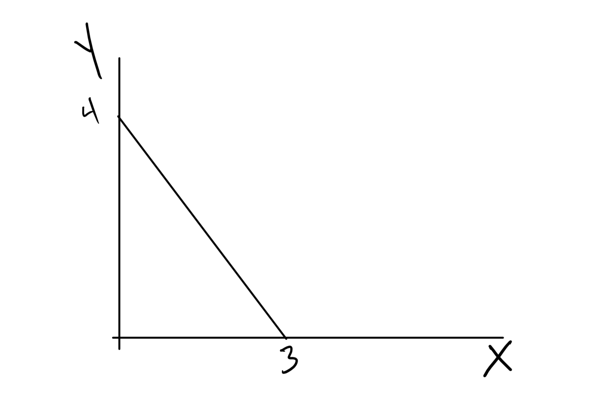
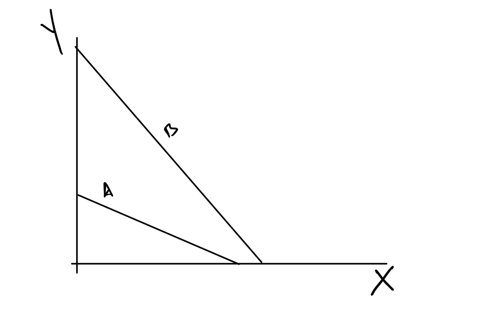
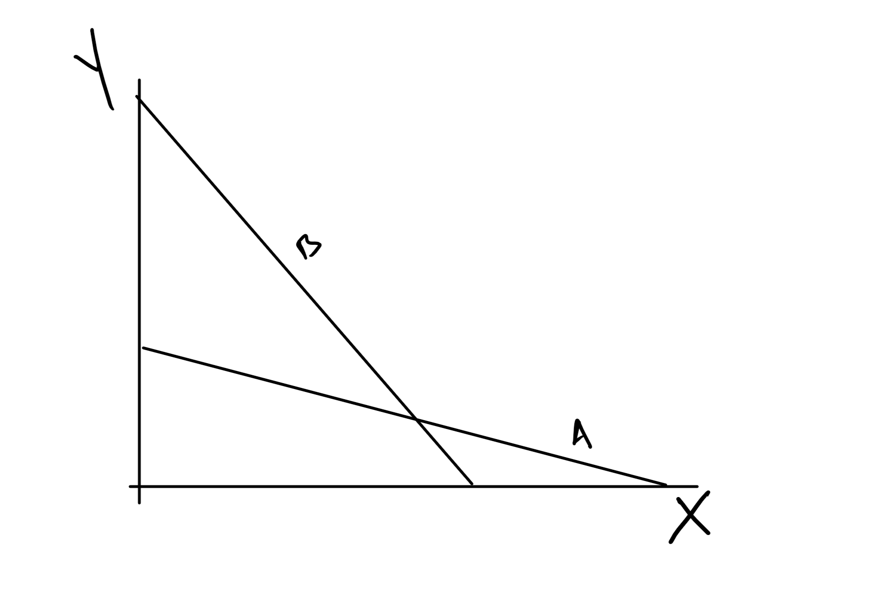
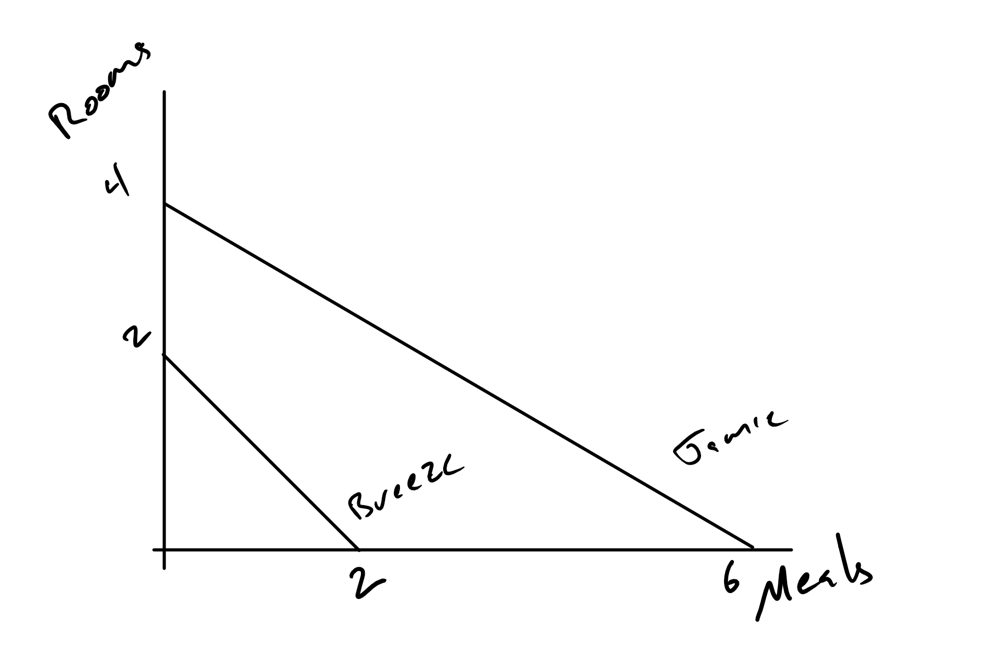

```{r setup, include=FALSE}
knitr::opts_chunk$set(echo = FALSE)
```


## Get Started On Basis for Trade

+ Learn how to calculate opportunity cost for constant opportunity cost PPFs.

+ Relate the PPF shape to "Comparative Advantage" and  "Absolute Advantage".

+ Show that specialization follows comparative advantage

+ Show that extent of specialization follows absolute advantage.

## Calculating Opportunity Cost with PPFs

+ We will stick with constant cost for now
+ Find how much of one good we must give up to get one more of another good.
    + Note the two good assumption.
+ Do this three ways:
    + Arithmetic logic
    + Algebraic logic
    + Calculus logic
    
## Our Sample PPFs



## Diagram Summary

+ Goods are "X" and "Y"
+ You can  make at  most 3 X before you run out of at least one resource.
+ You can make at most 4 of Y before you run out of at least one resource.
+ $Y = 4 - \frac{4}{3} X$


## Arithmetic Logic

+ With the same resources you can produce either $4 Y$ or $3 X$
+ Set those two equal to each other and solve for the cost of one good in terms of the other good.
+ Cost of good X is:

$$4 Y = 3 X$$

$$\frac{4}{3} Y = X$$

+ Cost of good Y is:

$$4 Y = 3 X$$

$$Y = \frac{3}{4}X$$

## Algebraic

Remember the equation for the PPF is:

$$ Y = 4 - \frac{4}{3} X$$

+ The opportunity cost of good X is the negative of the slope.
+ The opportunity cost of good Y is the inverse of the negative of the slope, $\frac{3}{4}$.


## Calculus

Again, the equation of the PPF is:

$$ Y = 4 - \frac{4}{3} X$$

+ The opportunity cost of good X is the negative of the derivative of Y wrt X.

$$- \frac{d Y}{d X} = \frac{4}{3}$$

## Relating PPFs to Comparative and Absolute Advantage

+ An agent has a comparative advantage when their opportunity cost of producing a good is lower.

+ An agent has an absolute advantage when they use all resources to produce one good, they can make more.

Note that absolute is about scale.

## Example 1




## Example 1 Summary

+ Comparative Advantage
    + A has comparative advantage in X
    + B has comparative advantage in Y.
+ Absolute Advantage
    + B has absolute advantage in both goods.

## Example 2



## Example 2 Summary

+ Comparative Advantage
    + A has comparative advantage in X
    + B has comparative advantage in Y.
+ Absolute Advantage
    + A has absolute advantage in Y.
    + B has absolute advantage in Y.

## Lets Do an  Application

Agents  |Rooms    | Meals |
---     |---      |---    |
Breeze  |2        |2      |
Jamie   |4        |6      |

+ There are two agents, Jamie and Breeze.
+ There are two goods produced, Clean rooms and meals
+ The table shows the maximum they can produce of each good if they only produce that good, i.e., they are the X and Y intercepts.

## Tasks

+ Draw the PPF diagrams
+ Figure out who has an *absolute advantage* in each good.
+ Calculate the opportunity costs of each good
+ Decide who has *comparative advantage* in each good.

## Draw the PPF diagrams

Agents  |Rooms    | Meals |
---     |---      |---    |
Breeze  |2        |2      |
Jamie   |4        |6      |

## Figure out who has an *absolute advantage* in each good.



Absolute Advantage?

## Absolute Advantage

+ Jamie can produce more of both goods.
+ Both Jamie's intercepts are larger than Breeze's

## Calculate the opportunity costs of each good


Agents  |Rooms    | Meals |
---     |---      |---    |
Breeze  |2        |2      |
Jamie   |4        |6      |

## Arithmetic Way

Breeze

$$2 ~Rooms = 2 ~Meals$$

+ 1 Meal = 1 Room

Jamie

$$ 4~Rooms = 6~Meals$$

+ $1 ~Room = \frac{6}{4}~ Meal$
+ $\frac{4}{6} ~Room =  1 ~Meal$

## Algebra/Calc

Jamie

$$Rooms = 4 - \frac{4}{6} Meals$$

Bree

$$Rooms = 2 - Meals$$

## Comparative Advantage

+ Jamie has a comparative advantage in Meals. $\frac{2}{3}< 1$
+ Breeze has a comparative advantage in Rooms. $1 < \frac{3}{2}$

## Now try to find gains from trade.

+ Show that it is possible for each one to specialize in the production of a good and produce more overall.
+ Show how you can distribute the extra so that everyone is at least as well as when they didn't trade.


## Consumption without Trade

Agents  |Rooms    | Meals |
---     |---      |---    |
Breeze  |0        |2      |
Jamie   |2        |3      |

Clearly, Bree does not like clean rooms.

+ Find production for each that is feasible and that produces more of at least one good without reducing the production of the other good.
    + At least 2 Rooms
    + At least 5 Meals
    
## My Solution for Production

Agents  |Rooms    | Meals |
---     |---      |---    |
Breeze  |2        |0      |
Jamie   |0        |6      |


But, this works too

Agents  |Rooms    | Meals |
---     |---      |---    |
Breeze  |2        |0      |
Jamie   |$\frac{2}{3}$| 5       |      

See the extra output?

## This just says it is possible

+ We don't know what will happen until we know what they like.
+ It could be that one person gets all the gains from specialization or they could share.

## Slightly Different Problem

Agents  |Rooms    | Meals |
---     |---      |---    |
Breeze  |2        |2      |
Jamie   |8        |12      |

I made Jamie twice as productive and made Jamie consume twice as much of both goods.

Agents  |Rooms    | Meals |
---     |---      |---    |
Breeze  |0        |2      |
Jamie   |4        |6      |

Try to create a production plan that creates at least as many rooms and meals.

## My Solution

Agents  |Rooms    | Meals |
---     |---      |---    |
Breeze  |2        |0      |
Jamie   |2 | $12 - 2\frac{6}{4} = 9$        |

Jamie had to produce some rooms too.  You can use Jamie's PPF equation to find the number of meals.

$$Rooms = 2 = 8 - \frac{4}{6} Meals$$

## Key thing to spot between  the two examples

+ Agents specialize in the direction of comparative advantage.
+ The degree depends on relative scale.  
    + Small places really specialize
    + Big places less so
    
    
## This just says possible

Remember, one person could grab all, or most, of the gains from trade.

It doesn't tell you what happens because it bad at predicting that.  You get that from another model, supply and demand.
