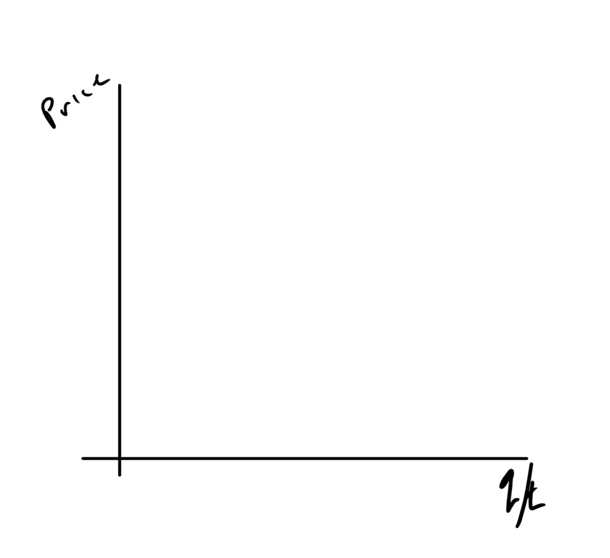
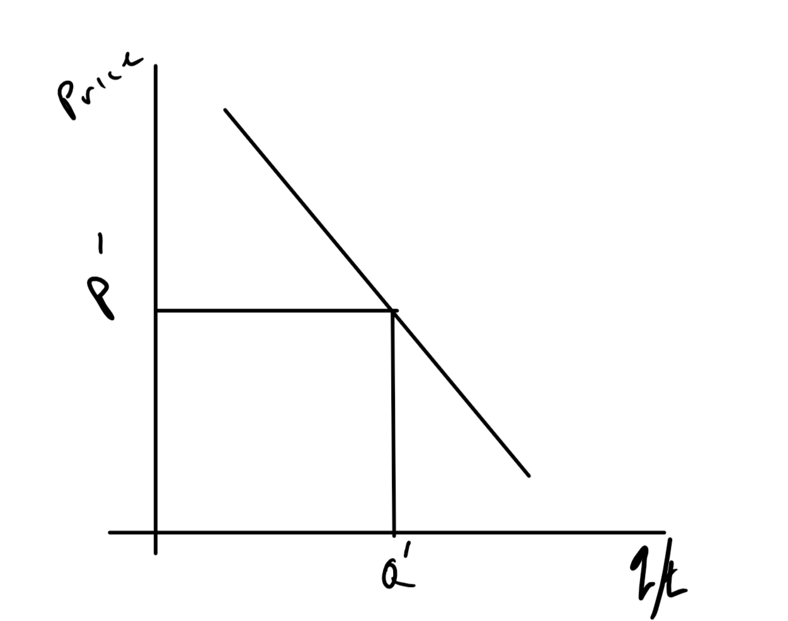
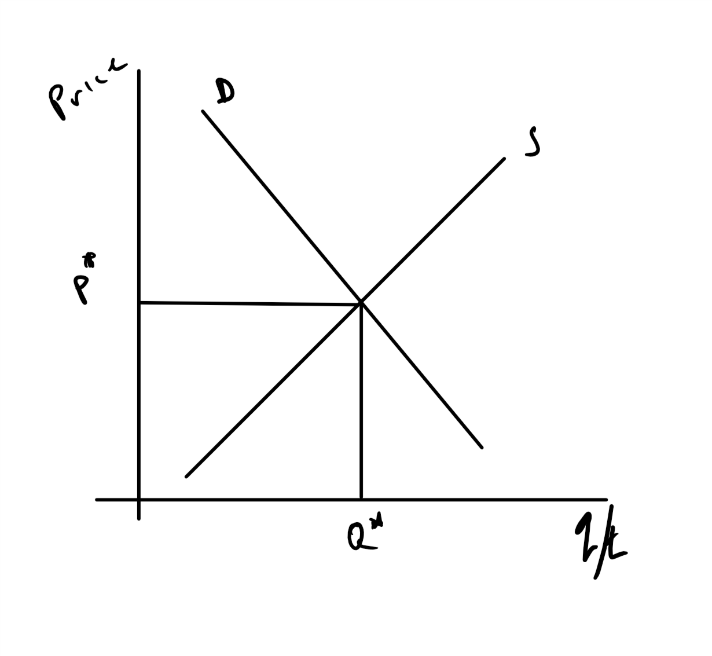
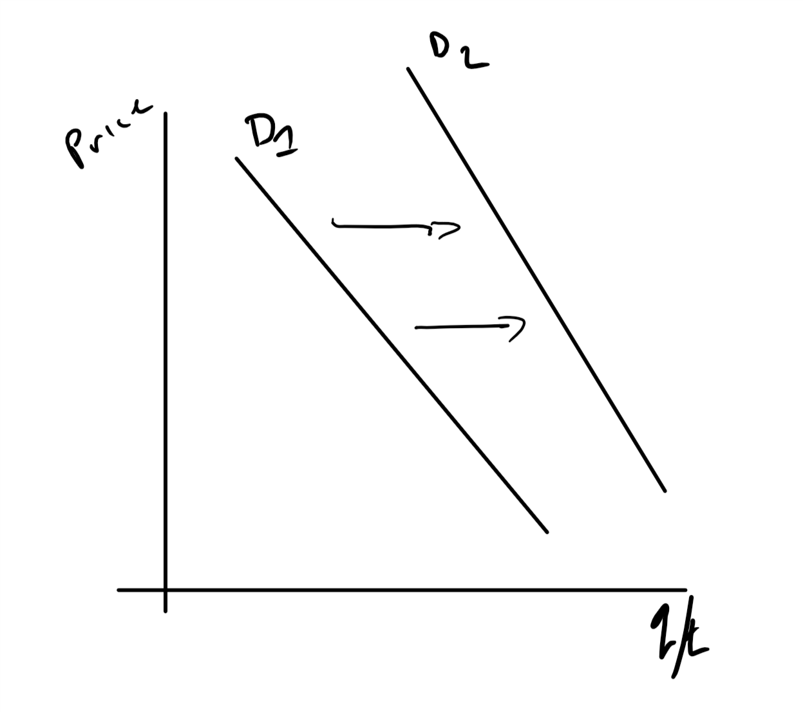
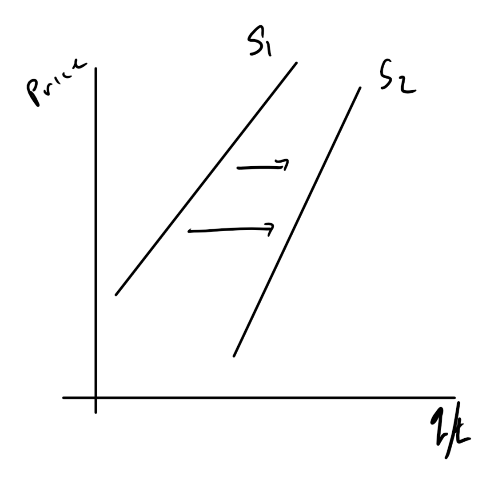
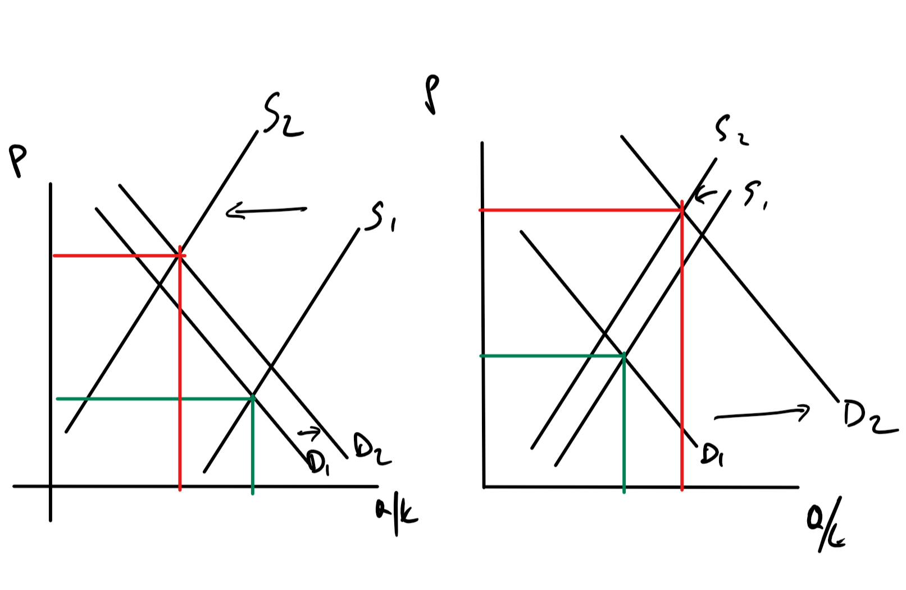
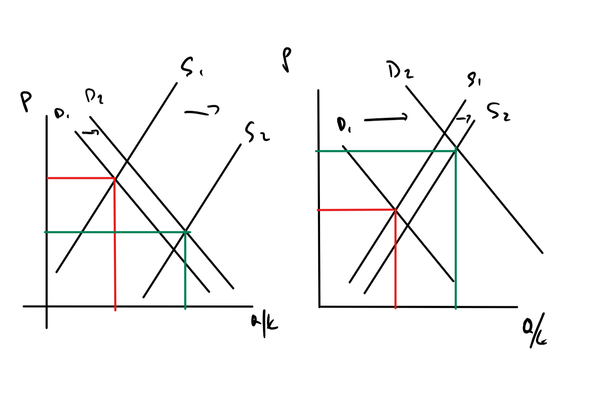

```{r setup, include=FALSE}
knitr::opts_chunk$set(echo = FALSE)
```


## Overview

Goal: Find the terms of trade, i.e., a forecast of prices and the volume of transactions

Concepts:

+ Supply - Quantity Supplied
+ Demand - Quantity Demanded
+ Competitive Equilibrium
+ Comparative Static Analysis (What happens when we change a parameter)

Tools:

+ Supply and demand analysis, aka The Big X.

## How to Describe a Market

Basic Parameters:

+ Characteristics of the good, e.g., Grade 1 coffee, roasted within the last 24hrs.
+ Location, e.g., inside Providence Park
+ Time Frame, e.g., Happy hour


Knowing what goods, suppliers and consumers are in the same market is tricky.  If the definition is too narrow or two broad, the answers are meaningless.

## Example of How it is Hard to Define a Market

Suppose you want to buy a used car.  What is the logical geographic boundary for your search?

Depends:

+ If you live in Portland, you would stick to the metro area and would not go looking in Scappoose.
+ If you live in Scappoose, you would look there *and* look in the Portland metro area.

There are criteria:

+ Analysts judgment is common and;
+ Data driven ones, e.g, do price changes in one area, drive purchase changes in another.

## Even trickier is how people think of the good.

+ To some people, coffee is coffee. Other people can distinguish many kinds.
+ The way people think of the product and how it is measured can differ too
    + Is the cost of electricity measured in $/month, or $/kWh?
    + Is gasoline measured in gallons, "I'll take 5 gallons of gas", tanks, "Fill'er up." or dollars, "I'll take $10 of regular."
    
## In the End: Price is on the vertical and quantity per time period is on the horizontal




## Lets Populate our Market

+ Buyers are represented by the *demand function*
+ Sellers are represented by the *supply function*

I will keep saying function for a while to remind people that these are not something like, "coffee demand is 20 tons", but describes a relationship between many parameters and quantity demanded, which I may call desired purchases to just make it clear.

## Demand

+ Demand is a function that takes lots of parameters, like income, price, prices of other goods, seasons and gives *quantity demanded*. 
+ We usually show demand on a graph as showing the relationship between the goods own price and quantity demanded.
+ All the other parameters change that relationship.  We usually talk about "shifts in demand" when these parameters change.
+ There is *usually an inverse relationship* between price and quantity demanded, i.e., when one goes up the other goes down.

Your own experience will verify that when prices go up, you tend to buy less of a good, holding everything else constant.

## Demand 



## Usually Inverse

There are exceptions:

+ Veblen, or Status, Goods
+ Giffen Goods
+ Goods with Asymmetric information, like buying a used car.

## Supply

+ Similar description to supply but this is about sellers.
+ The relationship between price and quantity supplied is direct, i.e.,  when one goes up, so does the other.


## Lets Put The Functions in a Perfectly Competitive Market

+ There are lots of different kinds of markets but this is the reference case
+ A market is perfectly competitive when:
    + There are many buyers
    + Many sellers
    + Buyers don't have to buy and sellers don't have to sell, 'Free entry and exit'.
    + Costs are Smithian, increasing or constant opportunity cost of production.
    + Good information environment where the goods are understood well by all, and all prices and transactions are public
+ Makes it very hard to collude, because there are no secret deals
+ All transactions tend to take place at the same price.

## Graphical



## Picture

+ I tend to use * for  equilibrium values
+ Where the lines cross is call the competitive equilibrium.
+ The equilibrium is stable:
    + If price goes too far above, someone, buyer or seller, will try to cut prices
    + If price goes too far below, someone, buyer or seller,  will try to raise prices
    
## About those Other Parameters

They move the demand and supply functions but the functions don't increase and decrease the "right" way. Alfred Marshall flipped the dependent and independent axes in 1890 and we never recovered.

+ An increase in either supply or demand is a movement to the right.
+ A decrease in either supply or demand  is a movement to the left.


I'm sorry for the inconvenience.

## Another Warning


+ The list of parameters that shift supply and demand are generally the same from book to book.
+ The most common difference is how beliefs about future prices work.
    + Your book has beliefs about future prices move both
    + Others have future price belief only move one or the other.
    
The difference is because of a concern that students will misunderstand and have all 'shocks', i.e., parameter changes, move both supply and demand.


## Increases in Demand



## Things that increase Demand

+ Income
    + $\uparrow$ Income for normal goods
    + $\downarrow$ Income for inferior goods
+ $\downarrow$ Price of Complements, good used together.
+ $\uparrow$ Price of Substitutes, good used instead of each other.
+ $\uparrow$ Anticipated future price
+ $\uparrow$ Population
+ $\uparrow$ Taste, catch all category that has to do with your preferences and understanding of the good.


## Increases in Supply




## Things that Increase Supply

+ $\downarrow$  Prices of inputs
+ $\uparrow$ Price of Complement in Production.
+ $\downarrow$ Price of Substitutes in Production.
+ $\downarrow$ Anticipated future price
+ $\uparrow$ Number of Firms
+ $\uparrow$ Technology, catch all category.


## Lets Move One Thing At a Time and See What Happens


## Try Again I


## Try Again II


## Try Again III


## When More Than One Thing Moves

+ There is a limitation on what you can know.
+ Often you can tell the direction of either price or transactions but not both.
+ If you want to know both, you need to quantify, and you will learn how to do this in econometrics when you get into systems estimation.


##  Only Knowing the Direction of Price Change



##  Only Knowing the Direction of Quantity Change



## Lets try this with math

$$P = 10 - 2 q_d$$

$$P =  3 q_s$$

##  Find the Competitive Equilibrium

+ Set the two equations equal to each other, both have P.
+ Solve for a common quantity, $q_s=q_d$, that is equilibrium quantity transacted, $q^*$.
+ Plug that quantity into one of the equations and solve for equilibrium price, $P^*$

## Solve for $q^*$

$$
\begin{split}
 10 - 2 q=  3 q\\
 10 = 5q\\
 q^* = 2
\end{split}
$$

## Find $p^*$

$$P = 3 q = 3 (2) = 6$$
or 

$$P = 10 -2 q= 10 - 2(2) = 6$$

## Now lets shift something

The key here is that we need to rephrase supply and demand so they better describe quantity than price.

$$
\begin{split}
P = 10 - 2 q_d\\
P-10 = -2 q_d\\
5 -\frac{P}{2}= q_d 
\end{split}
$$
Supply is easy $q_s= \frac{1}{3}p$

## Now lets give a shock

Firms will now supply 2 extra units no matter what the price.  This is an increase in supply, a shift to the right.

+ This changes supply to $q_s = \frac{1}{3} +2$
+ Demand remains the same.
+ Resolve for the new equilibrium


## Solve similar to before


+ Set the supply and demand equations, which now describe q, equal to each other.
+ Solve for $p^*$
+ Substitute into an equation to find $q^*$

## Math
$$
\begin{split}
\frac{1}{3}P +2=5 -\frac{1}{2}P\\
\left( \frac{1}{3}+ \frac{1}{2} \right ) P = 3\\
\frac{5}{6}P =3\\
p^* = 3 \left( \frac{6}{5}  \right)= \frac{18}{5}
\end{split}
$$

## Find new $q^*$

$$
q =\frac{1}{3}P +2 =\frac{1}{3} \frac{18}{5} + 2= \frac{6}{5} + 2= 3 \frac{1}{5}
$$


+ Note that price went from $6$ to $\frac{18}{5} = 5 \frac{3}{5}$
+ Transactions went from $2$ to $3\frac{1}{5}$
+ Direction is what you expect, $p \downarrow$ and $q \uparrow$


## Applications to Macro

+ Modern Macro does not always use a perfectly competitive market assumption
+ Wages are often sticky, not falling but allowed to rise.
+ Labor markets deviate from perfect competition
+ Firms are often modeled as monopolistic competitors.
+ Modern macro is now pretty explicit on the effects of financial markets.  2008 taught macro folks a lot.

But, it is a good first approximation to get macroeconomic intuition.

## Example

+ Suppose energy prices go up because of some trade sanctions, which hits all markets.
+ Your microeconomic intuition:
      + is that supply in all markets will decrease.
      + Prices should go up and sales should go down.
+ You know that some markets go the other way
      + Labor income of people in the energy industry will go up, Principle #10: One person’s spending is another person’s income
      
We will work on the consequences of things like this later in the course.


## Next Up

We will look at what happens when you start taxing goods or putting restrictions on how much can be bought or sold.

Get started on Chapter 4 for the next class.
