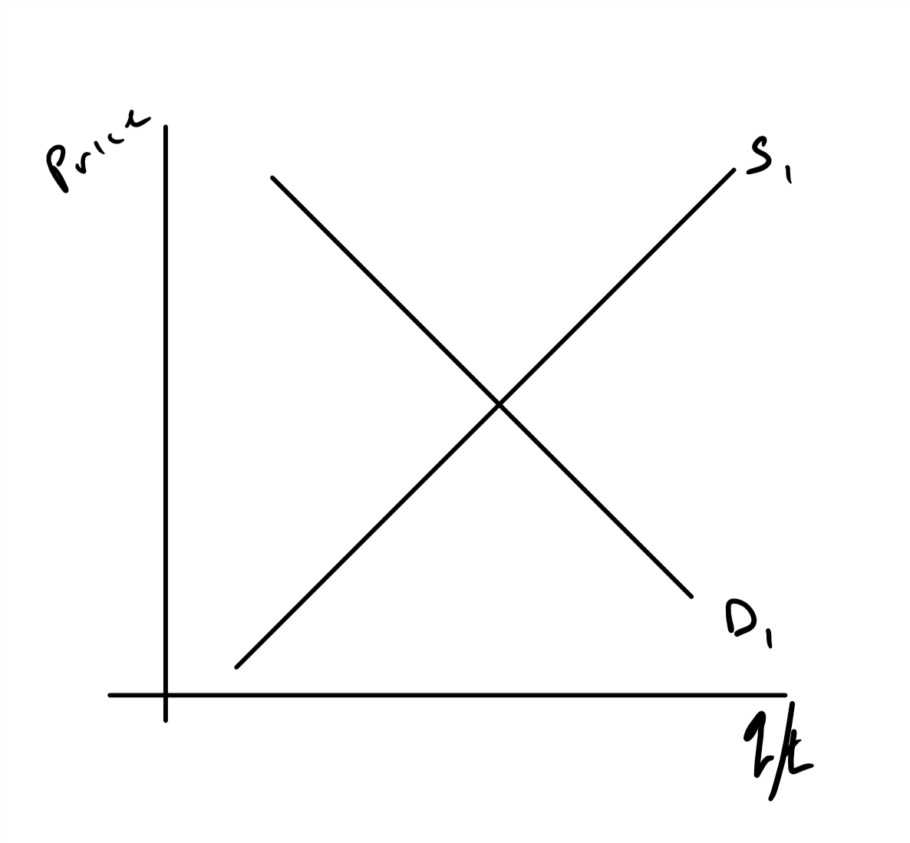
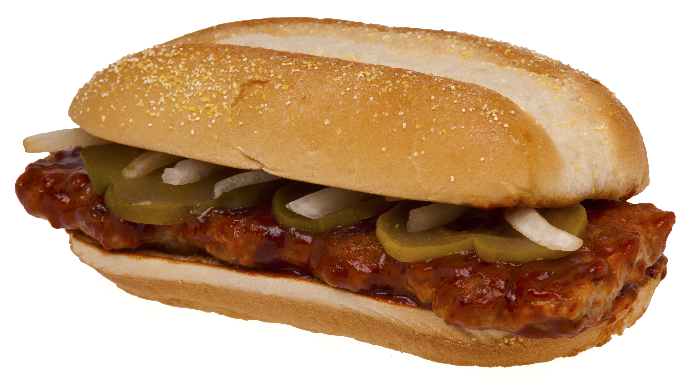

```{r setup, include=FALSE}
knitr::opts_chunk$set(echo = FALSE)
```

# Intial Thoughts

Supply and Demand is/are:

+ A great visual model fore making forecasts about the future direction of prices and quantities.
+ Often works well even when not exactly the right model to use.
+ Provides a general framework for quickly and easily thinking about externalities (Later in class)

# Generally

Things that increase consumers' likelihood of buying a good:

+ Increase price
+ Increase transactions
+ Observed prices and transactions trace out a supply function

Things that increase suppliers' likelihood of selling a good:

+ Decrease price
+ Increase transactions
+ Observed traces out a demand function

# Steps from Shock to New Equilibrium

1. Categorize the shock, e.g., increase in price of complement.
1. Give supply or demand implication, e.g., demand decreases
1. Tell if shortage or surplus at original price, $Q_d<Q_s$ therefore surplus.
1. Shortage or surplus drives a price change, e.g., $\downarrow P$.
1. Summarize new equilibrium, $P^{**}, Q^{**}$ with $\downarrow P$ and $\downarrow Q$

# Lets Move One Thing At a Time and See What Happens



# Try Again I


# Try Again II


# Try Again III


# Sample Stories and News

Some prices, e.g., electricity,  are fixed by regulation and set years ahead of time.  

+ Show a supply function that shows a single price no matter how much electricity is purchased.
+ Show what happens in this market (Not really perfect competition but still works) when you started zooming to class.
+ Does this make sense given your electric bill?


# Groceries

This is about eggs and meat. https://www.businessinsider.com/grocery-prices-record-breaking-april-spike-labor-department-2020-5

+ These are separated into restaurant and grocery store products early
+ Restaurants closed and people ate at home more.
+ Try supply and demand for grocery store meats.


# How about a trade war (2019)

https://www.reuters.com/article/us-usa-trade-china-pork/china-bought-u-s-pork-last-week-as-beijing-declared-halt-in-u-s-farm-purchases-idUSKCN1V523R

+ China stopped importing US pork.
+ What does this mean for pork prices and the pork sales in US?

{ width=50% }


# Gas

Take a look at US gas prices by month (https://www.eia.gov/dnav/pet/hist/LeafHandler.ashx?n=PET&s=EMM_EPMR_PTE_NUS_DPG&f=M)

+ Notice that June prices are almost always higher than January prices.
+ If oil, an input to gasoline, prices don't change from Jan to June

Show a diagram that explains this price increase.


# Lets try this with math

$$P = 10 - 2 q_d$$

$$P =  3 q_s$$

#  Find the Competitive Equilibrium

+ Set the two equations equal to each other, both have P.
+ Solve for a common quantity, $q_s=q_d$, that is equilibrium quantity transacted, $q^*$.
+ Plug that quantity into one of the equations and solve for equilibrium price, $P^*$

# Solve for $q^*$

$$
\begin{split}
 10 - 2 q=  3 q\\
 10 = 5q\\
 q^* = 2
\end{split}
$$

# Find $p^*$

$$P = 3 q = 3 (2) = 6$$
or 

$$P = 10 -2 q= 10 - 2(2) = 6$$

# Now lets shift something

The key here is that we need to rephrase supply and demand so they better describe quantity than price.

$$
\begin{split}
P = 10 - 2 q_d\\
P-10 = -2 q_d\\
5 -\frac{P}{2}= q_d 
\end{split}
$$
Supply is easy $q_s= \frac{1}{3}p$

# Now lets give a shock

Firms will now supply 2 extra units no matter what the price.  This is an increase in supply, a shift to the right.

+ This changes supply to $q_s = \frac{1}{3} P +2$
+ Demand remains the same.
+ Resolve for the new equilibrium


# Solve similar to before


+ Set the supply and demand equations, which now describe q, equal to each other.
+ Solve for $p^*$
+ Substitute into an equation to find $q^*$

# Math

$$
\begin{split}
\frac{1}{3}P +2=5 -\frac{1}{2}P\\
\left( \frac{1}{3}+ \frac{1}{2} \right ) P = 3\\
\frac{5}{6}P =3\\
p^* = 3 \left( \frac{6}{5}  \right)= \frac{18}{5}
\end{split}
$$

# Find new $q^*$

$$
q =\frac{1}{3}P +2 =\frac{1}{3} \frac{18}{5} + 2= \frac{6}{5} + 2= 3 \frac{1}{5}
$$


+ Note that price went from $6$ to $\frac{18}{5} = 5 \frac{3}{5}$
+ Transactions went from $2$ to $3\frac{1}{5}$
+ Direction is what you expect, $p \downarrow$ and $q \uparrow$
