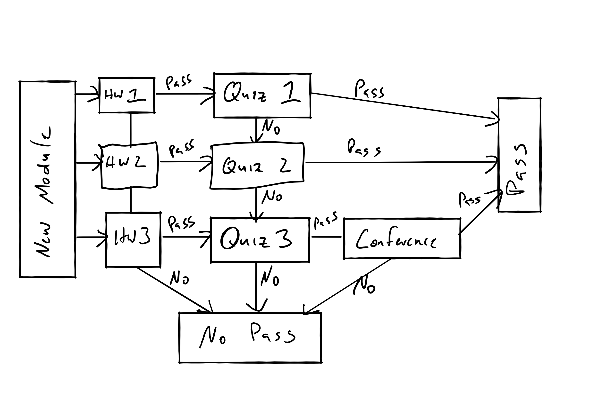

```{r setup, include=FALSE}
knitr::opts_chunk$set(echo = FALSE)
knitr::opts_chunk$set(fig.width=12, fig.height=8) 
```

## Plan for the Day

+ Play with Zoom
+ Walk through the syllabus
+ Walk through tools and resources
+ Talk about how to do well in the course.

## Zoom

+ Unmute and mute mic
+ Change your views
+ Show participants
    + Raise hand
    + Speed up
+ Show Chat Window
+ Write on my screen

## You Can Take the Class P/NP

If you  want to drop your stress level, change your grading option to P/NP.

+ Nobody will look at your 200 level grades.
+ Check with your funder and visa if it is an issue for you.

## Syllabus

+ You can find the syllabus here. (https://github.com/woodsjam/Course-Intro-Microeconomics/blob/master/SyllabusEC201Woods.pdf)

+ **Some** slides will also be on github. (https://github.com/woodsjam/Course-Intro-Microeconomics)


## Intro Micro (Official)

A study of the choices individuals face as participants in the markets for goods, services and factors of production like labor; behavior of profit-maximizing firms operating in markets with varying degrees of competitive pressure; potential role of government in intervening to influence market outcomes using taxes and subsidies; reasons for international trade and economic inequality.

## Intro Micro (Unofficial)

+ Talk many of you out of a business degree.
+ Convince you that economics is not **just** about money or markets.
+ Make the news and politicians funnier.
+ Talk some of you into being econ majors.


"Every man should have a built-in automatic crap detector operating inside him. It also should have a manual drill and a crank handle in case the machine breaks down." -- Hemingway 


## Who Am I?

+ Ph.D. Economist, UC Davis
+ First generation college, like many of you.
+ Background in energy conservation and program evaluation consulting going back to the early 90s.
    + Projects were multidisciplinary. Rarely did a project not involve, economists, engineers and others.
    + I have steel toed boots.
+ Former:
    + Oregon HECC commissioner
    + Parkrose School Board Chair
    + Multiple non-profit boards
    + County Budget Committees
    + Legislative Candidate.
+ Hobbies: Painfully Stereotypical Portlander

    
## Warnings About Me

+ I'm Dyslexic.  If you see a slide without a typo -- be amazed.
+ I have a _very_ dark sense of humor.
+ I am very direct.

## My Primary Motivation?

+ I'm not getting between you, your degree, and a 100K job.
+ I'm getting between you and a pile of debt and no way to pay it off.
+ I'm getting between you and your worst habits.


## Contact Information

+ There are no in-person office hours this term.  We will use Zoom to meet face to face. 
+ Drop in office hours are Monday 3-4pm and Tuesday 10am-Noon through the last week of class. I will keep a Zoom meeting up during this time.
+ You can schedule one-on-one meetings at https://woodsj.youcanbook.me/.

I will also keep Slack up during office hours to answer questions.

## Slack

I avoid email since it is a trash heap and a constant distraction.

+ The class will use slack https://fall20ec201.slack.com
+ Handles direct messages, forum style responses.
+ Phone and video
+ You should be able to sign up with your pdx.edu account
+ Can access via webpage, apps in Android and iOS.
+ Linked in d2l.
+ Officially supported PSU software
+ Common in industry
+ Many of you already use it.

## Hints on Slack

+ Prefer #general to direct messaging me.
    + Questions about course material is for #general
    + Questions about your grade or anything private is for @woodsj
+ Don't start and end with, "I got 7 but the key shows 245.  What did I do wrong?"
    + Show your work.  The fix is often a single parameter.
    + Give details about what you tried and how you are interpreting things.
    + Asking for general help, generally results in little help.
    + Get specific.
+ Provide full text of the question you are working on.

In short, make it easy for someone to help you.

## More Slack Hints

+ Don't impute motivation.  
+ Night before the exam?
    + I'm getting a good nights sleep -- you should too.
    + I tend to respond up until 5pm.
+ Set personal Do Not Disturb times.  It it defaults to 10pm -8am.


## Textbook 

Krugman, Paul R., and Robin Wells. Microeconomics ed. 5., Worth Publishers, 2018.(ISBN-10: 1-319-09878-9).  

+ This textbook is amazingly overpriced.
+ Will not be assigning questions out of the book.
+ Hint: You can rent an earlier edition for  under $20 just make it line up with the 5th edition readings.

## D2L

I will assume you know how  to work D2L, but lets peek anyway.

+ Calendar on left
+ Links on the right
+ Content, Quizzes and Grades up top
+ Zoom meetings in People.

## General Course Structure


+ 14 Modules and your grade is based on how many you complete.
+ Modules are available for three weeks.
+ Pass a homework and you cant take a quiz
+ Pass a quiz and you passed the module unless you pass in week 3.
  + You need to schedule and pass a one-on-one conference within two weeks to pass.

## Flow Chart



## Times

+ HW is due Monday Midnight.
+ HW graded Tuesday
+ Quizzes are open Wednesday 10am-1pm


## Homework

+ Due Monday at 11:59 PM, i.e., midnight
+ Turned in via D2L as or as a pdf or word document through D2L "assignment" function. 
+ _Do not_ write the assignments out by hand and then turn in a photo in pdf form. It tends to crash out the browser.
+ The photo technique works for individual diagrams, just not whole documents.


## Quizzes

+ A quiz in D2L will only be open if you pass a homework.
+ Open from 10am - 1pm Wednesday
+ You may have more than one open.
+ 35 multiple choice questions in each quiz.


## Assessments and Grade Policy

+ A: 12 Modules 
+ B: 10 Modules
+ C: 8 Modules
+ P: 8 Modules
+ D: 6 Modules


## It is your effort, not mine

+ I can give you exercises that use the tools discussed in class -- but if you don't do them ...
+ I can give you feedback and answer keys -- but if you don't look at them ...
+ I give guidance on what to read -- but if you don't read ...

You paid a "small" dollar amount to take this class, but the biggest cost is your motivation, effort and time. 

## About Preparation

+ The school of business has been concerned with students not learning in EC201/202 and gave a knowledge test to their students.
    + Students missed anything mathematical.
    + Students only were able to answer Costa's Level 1 questions, but little else.  For example, students could recognize a definition but could not an example that satisfies the definition.

Which is why we  have a math module.

## What  Math?

+ Add fractions
+ Multiply Fractions
+ Graph a line
+ Percent Change
+ Solve something like $x = 4 (2 + x)$ for x.
+ Solve solve two equations with two unknowns 

This is what we will be doing on Wednesday.

## Do your Own Work

+ A few facts on scale. https://www.plagiarism.org/article/plagiarism-facts-and-stats

+ How easy is it to outsource your class? https://www.google.com/search?q=take+my+online+class+for+me&rlz=1C1GGRV_enUS751US753&oq=take+my+online+class+for+me&aqs=chrome..69i57.4986j0j4&sourceid=chrome&ie=UTF-8

## Stop Procrastinating

+ Plenty of studies show that at least 2/3rds of you procrastinate.
+ Regular interaction, to create habit, is supposed to help.

http://success.oregonstate.edu/learning/stop-procrastinating

## So about you business majors

"With a five-year 31% underemployment rate according to Burning Glass, and a massive 601,092 degrees passed out in 2016, business and related majors produced a staggering 186,339 people with a degree and no corresponding college-level job. Counting the initial underemployment rate for business and related majors of 47%, a whopping 282,513 were underemployed in 2016." 

-- Strada Institute for the  Future of Work


## What are your local economists working on?

+ Randy Bluffstone: Ethiopia and Nepal stoves.
+ Sahan Dissanayake: How to preserve forests REDD+
+ John Gallup: How to tell when a survey changes when it is not documented.
+ John Hall: Heterodox
+ Hiro Ito: Trade imbalances and key currencies, and resiliency after natural disasters.

## More local economists

+ Arnab Mitra:  Lab experiments on dishonesty.
+ Cesar Rodriguez: Effects of financial openness on exchange rates
+ Rajiv Sharma: Did Obama-care increase discrimination?
+ Sarah Tinkler: Rajiv and her are coauthors on many papers.

## More

+ Forrest Williams: How you get people to donate more
+ ME: How do you get more energy efficiency and what else do you get with it.
+ Grade Arnold: Last paper was on effects of state abortion restrictions
+ Riju Joshi: The econometrician!  


